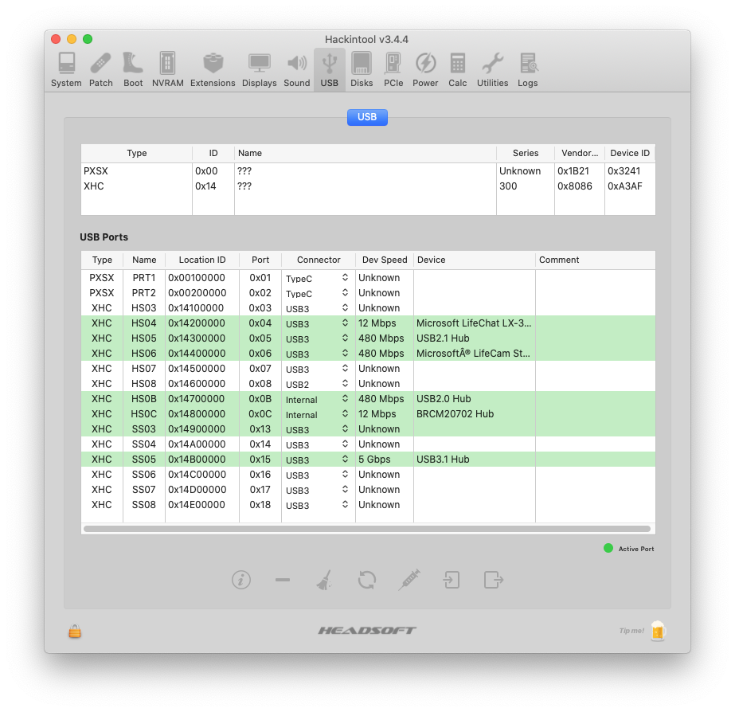
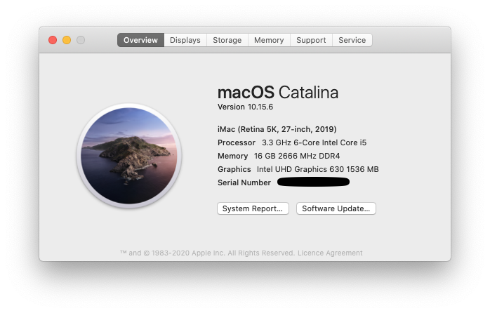
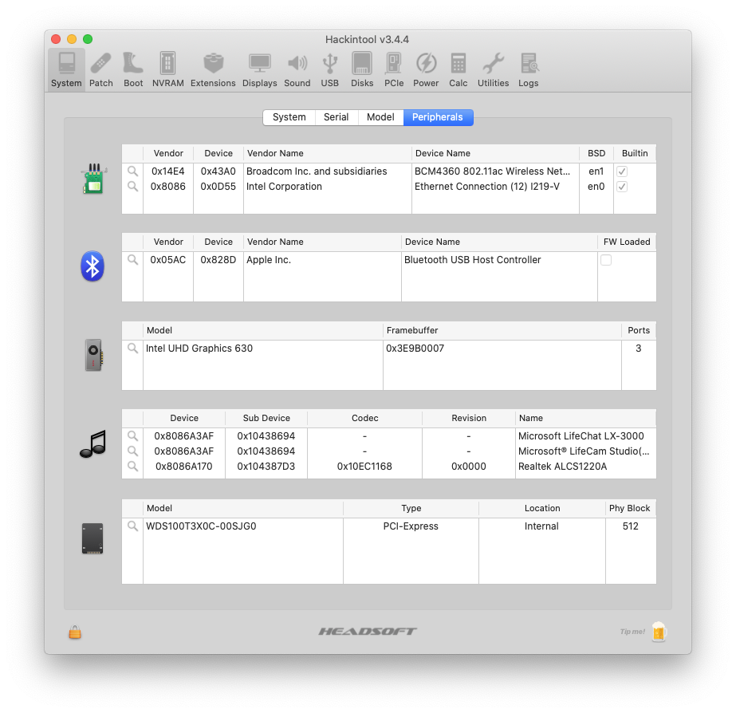

# Hackintosh ASUS ROG STRIX B460I

This repository is about a Hackintosh based on the **Asus ROG STRIX B460I** motherboard.

The Hackintosh is based on OpenCore (0.6.2 at time of writing) and macOS Catalina 10.15.7 following the [Dortania Guide](https://dortania.github.io/OpenCore-Install-Guide/) for [Comet Lake](https://dortania.github.io/OpenCore-Install-Guide/config.plist/comet-lake.html#starting-point).

The focus of this Hackintosh was looks, functionality and quiet operation rather than performance per Dollar. This has been achieved since there is currently nothing that doesn't work and the fans barely spin at all.

## Hardware

* Case: [Louque Ghost S1](https://www.louqe.com/ghost-s1/)
* Motherboard: [Asus ROG STRIX B460-I](https://www.asus.com/us/Motherboards/ROG-STRIX-B460-I-GAMING/) (BIOS version 0401)
* WiFi module: Broadcom BCM94360NG NGFF M.2. This replaces the intel chip that comes with the Asus board. See [here](https://www.tonymacx86.com/threads/the-everything-works-asus-z390-i-gaming-i7-8700k-sapphire-nitro-radeon-rx-vega-64-build.272572/#DW1560) for instructions on how to do this. The B460 board was chosen because it doesn't have a CNVi wifi module like the ROG STRIX Z490I board for example that can't be replaced. You can buy this module on eBay, Aliexpress or Amazon.
* CPU: [Intel Core i5-10600](https://ark.intel.com/content/www/us/en/ark/products/199273/intel-core-i5-10600-processor-12m-cache-up-to-4-80-ghz.html)
* Cooler: [Noctua NH-L12 Ghost S1 Edition](https://noctua.at/en/nh-l12-ghost-s1-edition)
* GPU: Intel UHD630 and [Sapphire Pulse RX 5600 XT BE](https://www.sapphiretech.com/en/consumer/pulse-radeon-rx-5600-xt-be-6g-gddr6). The normal (not BE) edition doesn't fit in the case!
* RAM: [CORSAIR VENGEANCE LPX DDR4 3000 16GB(8G×2)](https://www.corsair.com/uk/en/Categories/Products/Memory/VENGEANCE-LPX/p/CMK16GX4M2B3000C15)
* Storage: [Western Digital SN750 1 TB M.2-2280 NVME](https://www.westerndigital.com/products/internal-drives/wd-black-sn750-nvme-ssd)
* PSU: [Corsair SF 600W 80+ Platinum](https://www.corsair.com/us/en/Categories/Products/Power-Supply-Units/Power-Supply-Units-Advanced/SF-Series/p/CP-9020182-NA)

## Details

### BIOS
There is no CFG-lock issue with this board.

Things I changed from default:
* Fast boot: OFF
* Intel Virtualization Technology: ON
* OS type: Windows UEFI
* Multi Monitor support: ON
* Clear the platform key as this disables secure boot.

### SSDTs
Compiled by following the [Dortania's ACPI Guide](https://dortania.github.io/Getting-Started-With-ACPI/), the `.dsl` SSDT files can be found in SSDTS folder. You will need [MaciASL](https://github.com/acidanthera/MaciASL) to compile them.

* SSDT-AWAC (enable the legacy RTC clock)
* SSDT-EC-USBX (Fix embedded controller)
* SSDT-PLUG (Power management)
* SSDT-RHUB (reset USB controller)
* SSDT-SBUS-MCHC (SMBus support)
* [SSDT-RX5700XT](https://www.tonymacx86.com/threads/amd-radeon-performance-enhanced-ssdt.296555/) (Better support for RX5600/5700)

### Kexts
Download them from their official repo
* [AppleALC.kext](https://github.com/acidanthera/AppleALC) - Audio
* [FakePCIID.kext](https://github.com/RehabMan/OS-X-Fake-PCI-ID) and FakePCIID_Intel_HDMI_Audio.kext - Also needed for audio to work
* [IntelMausi.kext](https://github.com/acidanthera/IntelMausi) - Ethernet
* [Lilu.kext](https://github.com/acidanthera/Lilu) - Enables various patching
* [NVMeFix.kext](https://github.com/acidanthera/NVMeFix) - Better NVMe support
* [VirtualSMC](https://github.com/acidanthera/VirtualSMC) SMCProcessor.kext, SMCSuperIO.kext, VirtualSMC.kext - SMC emulator
* USB-Map.kext - Available from the kexts folder in this repo. This maps the 6 USB3 ports and the two internal ones used for Bluetooth and the Aura header. See USB section.
* [WhateverGreen.kext](https://github.com/acidanthera/WhateverGreen) - Various graphics related patches
* [XHCI-unsupported.kext](https://github.com/RehabMan/OS-X-USB-Inject-All) - There is a patched version of this in this repo. Needed for USB3 to work.
* [DAGPM.kext](https://www.tonymacx86.com/threads/amd-radeon-performance-enhanced-ssdt.296555/) - Better power management for AMD Navi GPUs.

### USB
This board has two USB controllers. The Intel one that drives the 6 USB3 ports on the rear panel as well as Bluetooth and the Aura header. I'm not using the internal USB ports - so the supplied USB Map will not map these. Currently 14 ports are mapped - so there is room for one more internal port. The second controller is for the rear USB-C port and it doesn't need a USB map.

The front USB ports that I didn't map have the following IDs (thanks to [zhzhzh88](https://www.reddit.com/r/hackintosh/comments/hbcdgq/asus_rog_strix_b460i_gaming_mobo_hackintosh/g8cmw5b?utm_source=share&utm_medium=web2x&context=3)):
* HS01, port 0x01 (USB2)
* HS02, port 0x02 (USB2)
* SS01, port 0x11 (USB3)
* SS02, port 0x12 (USB3)

In addition to the USB-Map.kext you also need the modified XHCI-unsuported.kext to enable USB3 ports. The modification is to add an entry for device id 0xa3af8086. See [here](https://github.com/RehabMan/OS-X-USB-Inject-All/issues/29)

### Note on Navi GPU
I found that installing the kext and SSDT from [here](https://www.tonymacx86.com/threads/amd-radeon-performance-enhanced-ssdt.296555/) not only improves Geekbench scores (see below), but also real world performance in Mafia III. Without it the GPU seemed to thermal throttle after a few minutes of playing and the frame rate would drop really low. Interestingly I did not see this happen with [Unigine Heaven](https://benchmark.unigine.com/heaven) which is much harder on the GPU.

### Config.plist

#### DeviceProperties
Below are the properties that are board specific or deviate from the [Dortania guide](https://dortania.github.io/OpenCore-Install-Guide/config.plist/comet-lake.html)

##### Graphics
PciRoot(0x0)/Pci(0x2,0x0)
 * AAPL,ig-platform-id = 07009B3E
 * framebuffer-patch-enable = 01000000
 * igfxfw = 02000000
 * device-id = 9B3E0000

The device-id is needed, otherwise you will get crashes in Firefox/Safari and probably elsewhere.
igfxfw enables the Apple firmware to be uploaded which improves performance.

##### Audio
PciRoot(0x0)/Pci(0x1F,0x3)
 * device-id = 70A10000
 * layout-id = 0B000000
 
#### Kernel
 Quirks > DisableRtcChecksum = TRUE - This prevents the BIOS from restarting into safe mode
 Misc > Boot > HibernateMode = Auto - Not sure if this is necessary. The machine sleeps fine without this, but maybe this enables deeper hibernation.
 All other settings follow the Dortania guide.

#### NVRAM
7C436110-AB2A-4BBB-A880-FE41995C9F82 > boot-args: Add agdpmod=pikera - This is needed for Navi GPUs to work.

### Benchmarks

| Item | Score |
|---|---|
| CPU - Geekbench | [Single / Multi-Core](https://browser.geekbench.com/v5/cpu/3795927): 1221 / 6275 |
| Intel UHD630 - Geekbench | [OpenCL](https://browser.geekbench.com/v5/compute/1509911) / [Metal](https://browser.geekbench.com/v5/compute/1509921): 5319 / 4972 |
| RX 5600 XT - Geekbench | [OpenCL](https://browser.geekbench.com/v5/compute/1612224) / [Metal](https://browser.geekbench.com/v5/compute/1612235): 43209 / 45144 |
| RX 5600 XT - Geekbench ([with Radeon performance improvements](https://www.tonymacx86.com/threads/amd-radeon-performance-enhanced-ssdt.296555/)) | [OpenCL](https://browser.geekbench.com/v5/compute/1662816) / [Metal](https://browser.geekbench.com/v5/compute/1662822): 54139 / 61044 |

### Screenshots

### References
* [Dortania Configuration](https://dortania.github.io/docs/latest/Configuration.html)
* [ASUS ROG strix Z490I Hackintosh](https://github.com/jergoo/Hackintosh-ROG-STRIX-Z490I)
* [ASUS ROG strix B460I Manual](https://dlcdnets.asus.com/pub/ASUS/mb/LGA1200/ROG_STRIX_B460-I_GAMING/E16234_ROG_STRIX_B460-I_GAMING_UM_WEB.pdf)